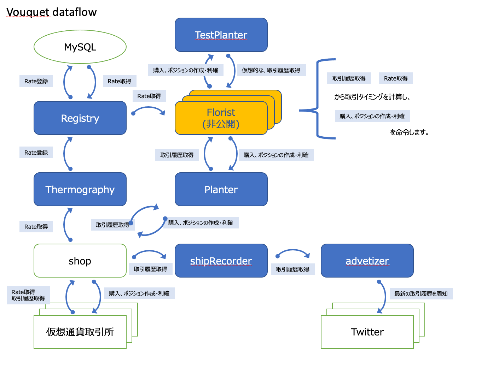

Vouquet
===

* Vouquet は、仮想通貨を対象とした、自動/半自動取引システムです
	* [公開仕様](./public/README.md) をご覧いただき、"Florist"を開発することで、Vouquetを利用できます
* Vouquet (Virtual coin bOUQUET) では、個々の仮想通貨の思想を元に仮想通貨という種子を育て、立派な花束(資産)を作成することをコンセプトとしています
	* [コンセプト詳細](./public/concept.md)

### 構成

詳細は、[公開仕様](./public/README.md)をご覧ください

### 注意事項

* Vouquet を利用した取引に関しては自己責任です
	* ライブラリの動作保証も行っておりません

## 対応パラメータ

### Soil(取引所)

| パラメータ | 一般的な名称 |取引所URL | 備考 |
| :---: | :---: | :---: | :---: |
| `coinzcom` | GMOコイン | https://coin.z.com/jp/ | |
| `bitflyer` | Bitflyer | https://bitflyer.com//ja-jp/ | |
| `coincheck` | Coincheck | https://coincheck.com/ja/ | まだfloristerからの呼び出しに非対応 |

### Seed(通貨名+現物orレバレッジ)

| パラメータ |
| :---: |
|`BTC2JPY_spt`|
|`BTC2JPY_mgn`|
|`ETH2JPY_spt`|
|`ETH2JPY_mgn`|
|`BCH2JPY_spt`|
|`BCH2JPY_mgn`|
|`LTC2JPY_spt`|
|`LTC2JPY_mgn`|
|`XRP2JPY_spt`|
|`XRP2JPY_mgn`|
|`XLM2JPY_spt`|
|`XLM2JPY_mgn`|
|`MONA2JPY_spt`|
|`MONA2JPY_mgn`|

* 現物orレバレッジ
	* `_spt`
		* 現物指定
	* `_mgn`
		* レバレッジ指定

### インストール手順
1. [公開仕様 ##Florist 開発/リリース 方法](./public/README.md#florist-開発リリース-方法) を利用し、floristの開発やbuildを行う
2. [Vouquetのサーバインストール手順](./ope/install.md)

### レポート方法

* 質問や報告がある場合、[Issueの一覧](https://github.com/vouquet/vouquet/issues) に同じ質問がないことを確認してから、[Issue作成](https://github.com/vouquet/vouquet/issues/new)をしてください
* [PullRequest](https://github.com/vouquet/vouquet/pulls) を投げつけて下さっても問題ありません

---
### link

* [公開仕様](./public/README.md)
* [非公開仕様や運用手順リンク(開発メンバ用)](https://github.com/vouquet/private_docs)
