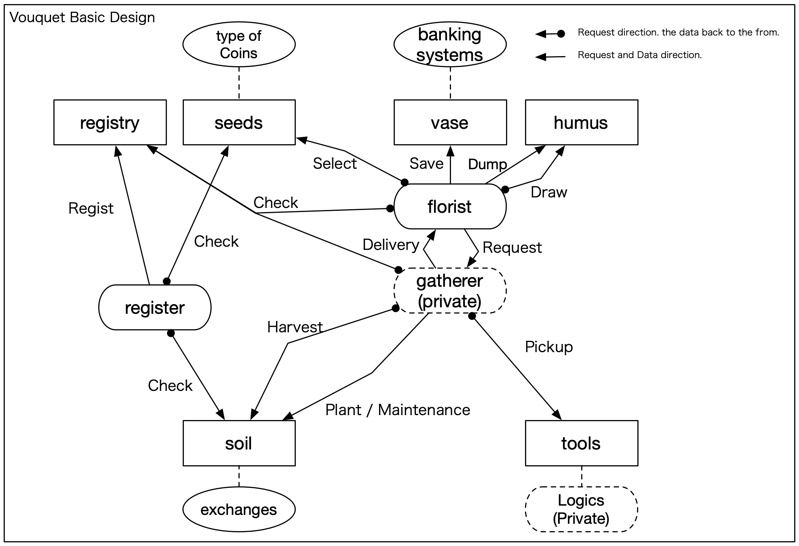

vouquet
===

* vouquet (Virtual coin bOUQUET) は、個々の仮想通貨の思想を元に仮想通貨という種子を育て、立派な花束(資産)を作成するプロジェクトです。
* 取引ロジックは非公開ですが、APIの利用周り等は公開していきます。

---

* 2020/03/01時点の大枠設計思想

---
* 各種リンク
	* [公開仕様](./public/README.md)
	* [非公開仕様や運用手順リンク(開発メンバ用)](https://github.com/vouquet/private_docs)
