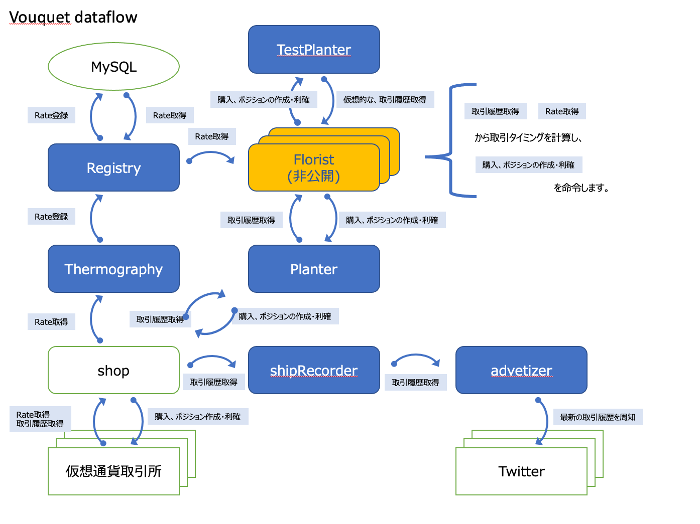

Vouquet 公開仕様
===

## 各種実行ファイルの説明

* [vqt_registrar](./elf/vqt_registrar.md)
	* rateをmysqlへ記録します
* [vqt_florister](./elf/vqt_florister.md)
	* floristをimportし、rateを元に取引をおこないます
* [vqt_eval](./elf/vqt_eval.md)
	* floristをimportし、過去のrateを流し込むことで、擬似的に過去の取引結果を再現します
	* floristの性能評価をおこないます
* [vqt_noticer](./elf/vqt_noticer.md)
	* 取引所の結果を取得し、通知します
	* 現在は、Twitterのみ通知可能です

## florist 開発方法
	* 未準備
	* [共通インタフェースの用意後](https://github.com/vouquet/vouquet/issues/18) に、手順の追加をおこないます
