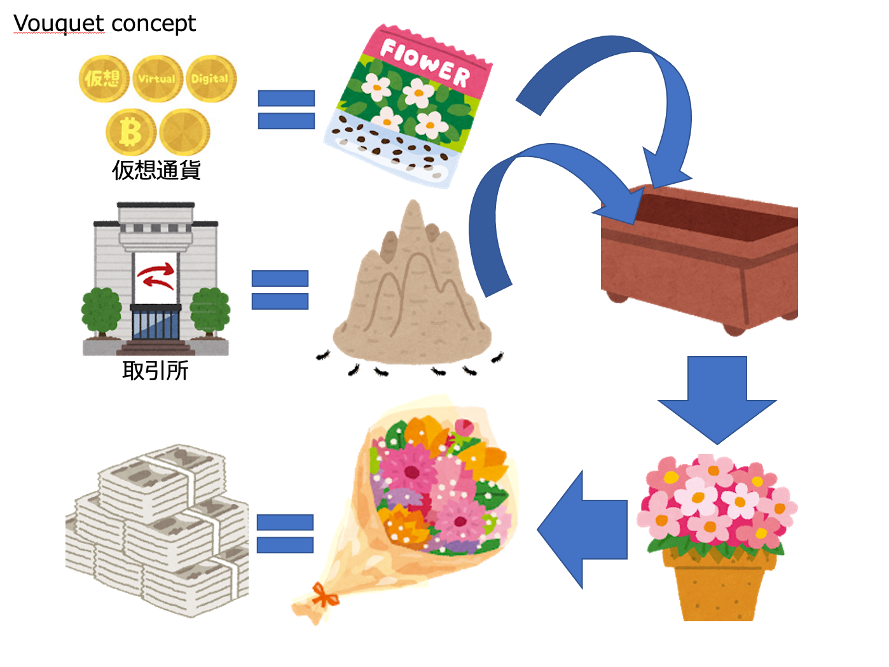
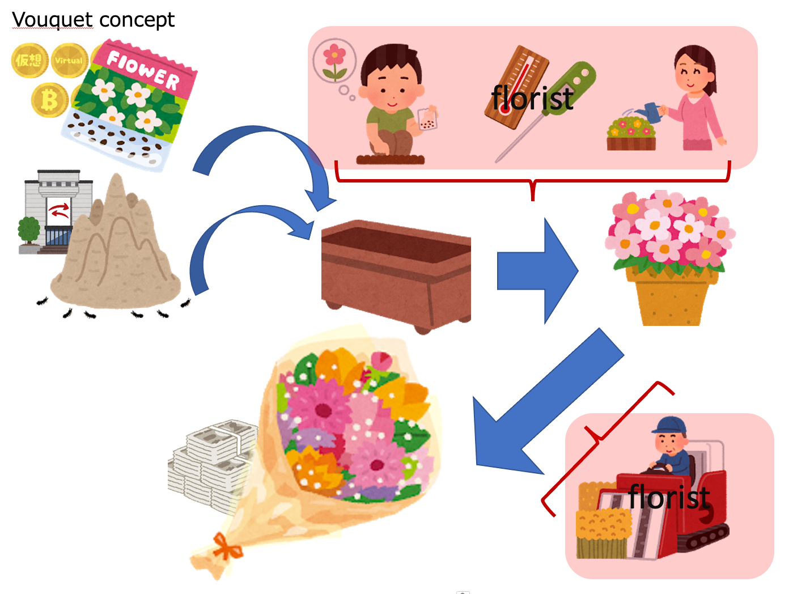

コンセプト詳細
===

* Vouquet (Virtual coin bOUQUET) では、個々の仮想通貨の思想を元に仮想通貨という種子を育て、立派な花束(資産)を作成することをコンセプトとしています

---

Vouquetでは、  
仮想通貨を種子(Seed)、取引所を土(Soil) と捉え、  
それらを立派に育て、立派な利益(花) となったところを収穫する イメージで、  
各種ライブラリを開発しています。  

---

現実の花の場合、植えて放置では、立派にならないように、  
何事もメンテナンスを行わなければ、いけません。  
この育てる知識や、収穫に適した時期を見極める知識は、とても重要な資産であると捉えており、  
本プロジェクトでは、非公開としています。  

しかし、誰しもが学びやすい、試しやすい環境を用意することで、  
仮想通貨人口が少しでも増え、仮想通貨の価値が上がることは、望んでいます。  
そのため、本プロジェクトは、育てる収穫する知識以外の全てを公開する形で開発しています。  
