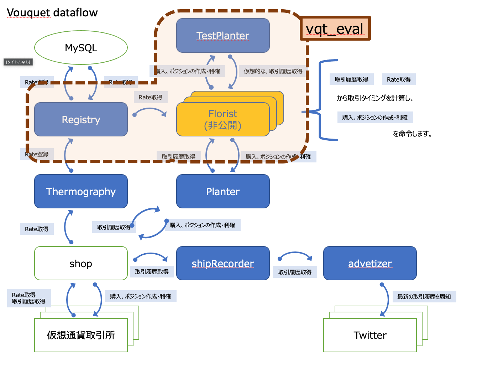

vqt_eval
===
floristをimportし、過去のrateを流し込むことで、擬似的に過去の取引結果を再現します  
floristの性能評価をおこないます

## img



## usage
```
vqt_eval [-c <config path>] [-v|-vv] <start-date(yyyy/mm/dd)> <end-date(yyyy/mm/dd)> <SEED> <SOIL> <SIZE>
```

* `-c <config path>`
	* [config](../../../var.in/service/vouquet/etc/vouquet.conf) を指定します
* `-v | -vv`
	* 出力されるログの詳細度を変えます
	* どれも指定しない場合、さまりだけが表示されます
* `<start-date(yyyy/mm/dd)> <end-date(yyyy/mm/dd)>`
	* 擬似的に実施する取引の期間を指定します
	* start-dateの0時0分00秒(00msec)から、end-dateの23時59分59秒(999999msec)までで実施されます
* `<SEED>`
	* 仮想通貨名を指定します
* `<SOIL>`
	* 仮想通貨取引所を指定します
* `<SIZE>`
	* 取引を行うサイズを指定します
	* `0.01BTC`単位で取引を行う場合の指定は、`0.01`です

