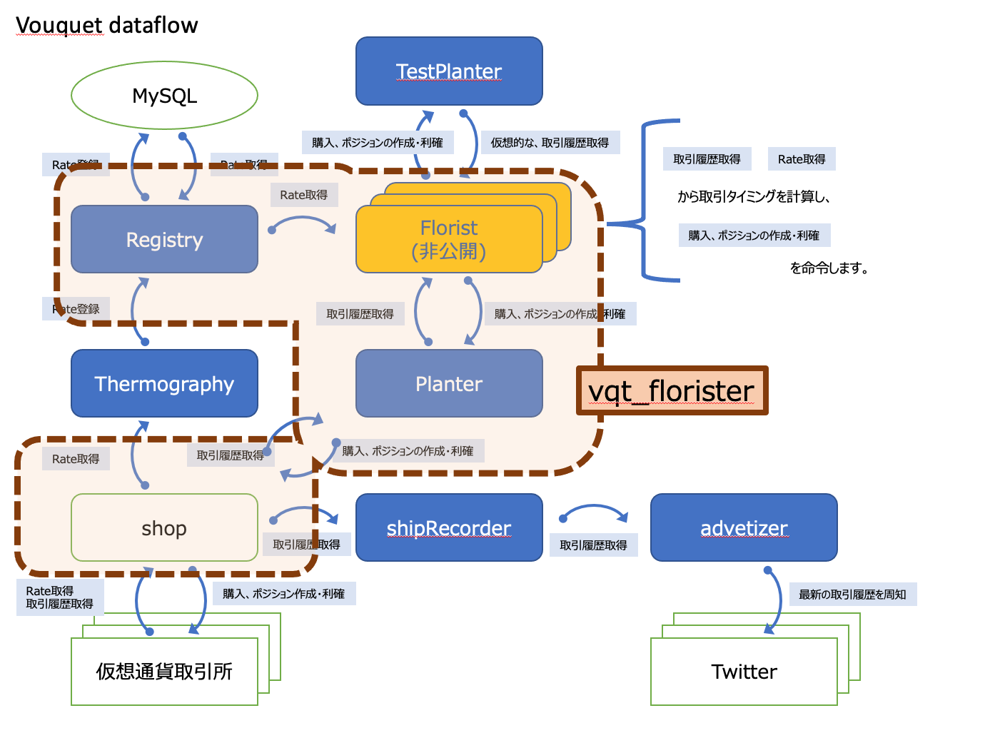

vqt_florister
===
floristをimportし、rateを元に取引をおこないます

## img



## usage
```
vqt_florister [-c <config path>]
```

* `-c <config path>`
	* [config](../../../var.in/service/vouquet/etc/vouquet.conf) を指定します
