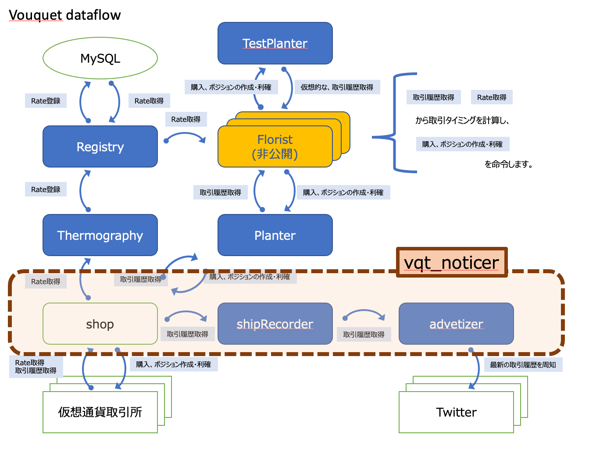

vqt_noticer
===
取引所の結果を取得し、通知します

## img



## usage
```
vqt_florister [-c <config path>] <Path of Credentical Twitter> <SEED> <SOIL>
```

* `-c <config path>`
	* [config](../../../var.in/service/vouquet/etc/vouquet.conf) を指定します
* `<Path of Credentical Twitter>`
	* [tw_config](../../../var.in/service/vouquet/etc/tw_config) を指定します
* `<SEED>`
	* 仮想通貨名を指定します
* `<SOIL>`
	* 仮想通貨取引所を指定します

